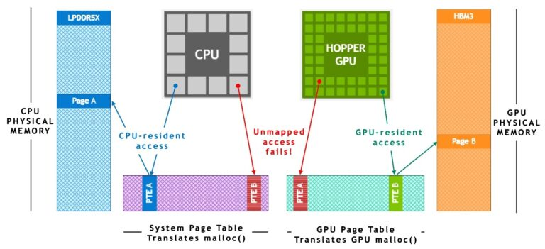
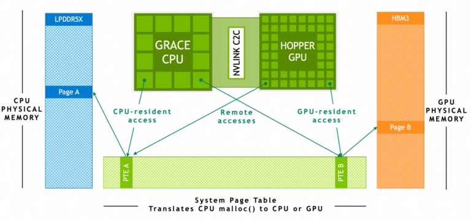
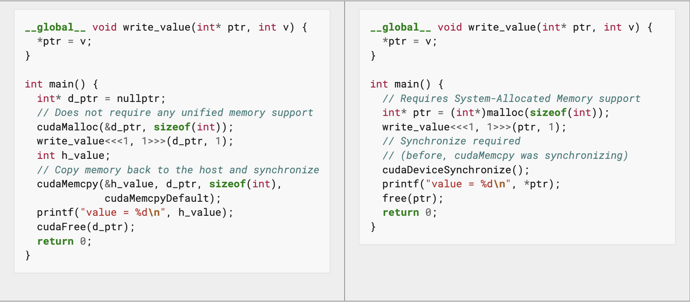

# CPU-GPU統合アーキテクチャにおけるメモリ効率化と高速化

## GPU プログラミング
GPUプログラミングとは、グラフィックス処理ユニット(GPU)の多数の演算コアを活用し、大量のデータを並列に処理するためのプログラミング手法です。従来のCPUに比べて高い並列性を持つため、科学技術計算や機械学習、シミュレーションなど計算量の多い処理を高速に実行できます。代表的なプログラミング環境としては、NVIDIAのCUDAがあげられます。
従来のCUDAによるGPUプログラミングではCPUとGPUは完全に別々のデバイスとして想定されており, ページテーブルも別々のものでした。そのため, GPUでプログラムを実行する際はGPUメモリにデータをコピーしてからGPUがプログラムを実行していました。そのため, GPUメモリを超えた処理を行うことはできませんでした。

## CPU-GPU統合アーキテクチャのハードウェア
NVIDIA GH200(Grace Hopper Superchip)は、NVIDIAが開発したCPUとGPUの統合型プロセッサです。高性能なArmベースCPU「Grace」と最新のHopperアーキテクチャGPUを、NVLink-C2C(Chip-to-Chip)と呼ばれる超高速インターコネクトで直結しています。これにより、CPUとGPU間で大容量のメモリ空間を共有し、高速かつ効率的なデータ転送を実現します。GH200は、AI学習やHPC(高性能計算)など、メモリ帯域幅やデータアクセスがボトルネックとなるアプリケーションで特に高い性能を発揮します。
また, このNVIDIA GH200にはAddress Translation Servicesという機能があります。Address Translation Services(ATS)とは、GPUがCPU側の仮想メモリアドレスを直接参照できるようにする仕組みです。これにより、従来別々だったCPUとGPUのページテーブルは共通化され, GPUにデータをコピーすることなくCPUのデータを参照することが可能になりました。

これによる利点が2つあります。まず1つ目はプログラミングが容易となることです。従来はGPUにデータを転送してGPUで実行し, CPUにデータを書き戻すというプログラムを書く必要がありましたが, GH200のCPU-GPU統合アーキテクチャではデータの置き場所に関わらずプログラムを実行することができます。これにより, GPUプログラムを書くための工数が少なくなり, 生産性の工場に寄与します。

2つ目に, 使えるメモリの量が増えます。従来のGPUプログラミングではGPUメモリ以上のデータを一度に処理することは不可能でしたがGH200ではCPUとGPUのメモリを合わせたメモリの量までに使えるデータが増えます。これにより, GH200の場合は最大で576GBのデータを処理することができます。
大量のデータを捌くタスクにおいてGH200の貢献は高いと考えられます。

## Mission: 省メモリと高速化
ここまででは夢のデバイスのように聞こえるGH200ですが, CPUメモリにおいてあるデータに対してCUDA Kernelを実行することには問題点があります。1つ目にはGPUプロセッサからGPUメモリにアクセスすることよりもCPUメモリにアクセスすることの方が速度遅延の発生が大きいことです。これはGPUのHigh Bandwidth memoryとCPU側のメモリとNVLink C2Cそれぞれが異なる帯域幅を持つためです。これはGH200アーキテクチャに本質的に備わっている特性のため, 行う計算がmemory-boundなものかcompute-boundなものかによりデータの置き場所を工夫する必要があります。
2つ目にはメモリ管理の問題があります。システムメモリは物理メモリが割り当てられていない状態でアクセスされるとページフォールトが起こり, 大きな速度遅延が発生します。この問題に対処するため, メモリ解放の際にはOSにメモリを返すのではなくメモリプールに一度割り当てたメモリを貯めておくといった解決策があります。
これら2つの問題に対して測定を行い検証を進めながら研究をしています。
